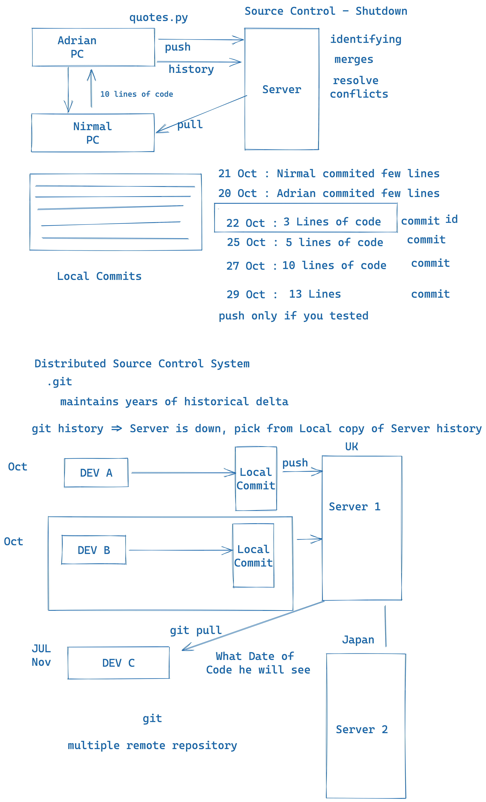

#### Repository Setup for Training 

---

- GitHub : power-automate-cc
- VS Code Setup 
- Windows : CMDER Command Prompt
- GitBash : Git for Windows
- VSCode + Terminal Configure + CMDER
- VSCode Swagger Extension 

woking Copy : Local Repository

// Source Control

// Github : Platform - Git Source Control - Hosting - Collaborate

// Git : Linus Torvald

Subversion
VSS : Visual Source Safe. Microsoft

Subversion : 

TFS : Team Foundation Services , 40,000 files.

Git : Microsoft Started Embracing : GIT 

Repository 

- Project
- Clone
- Commit
- Checkout
- Branching
- Merge
- Pull 
- Push
- Pull Request - PR ( Github, BitBucket, GitLab)